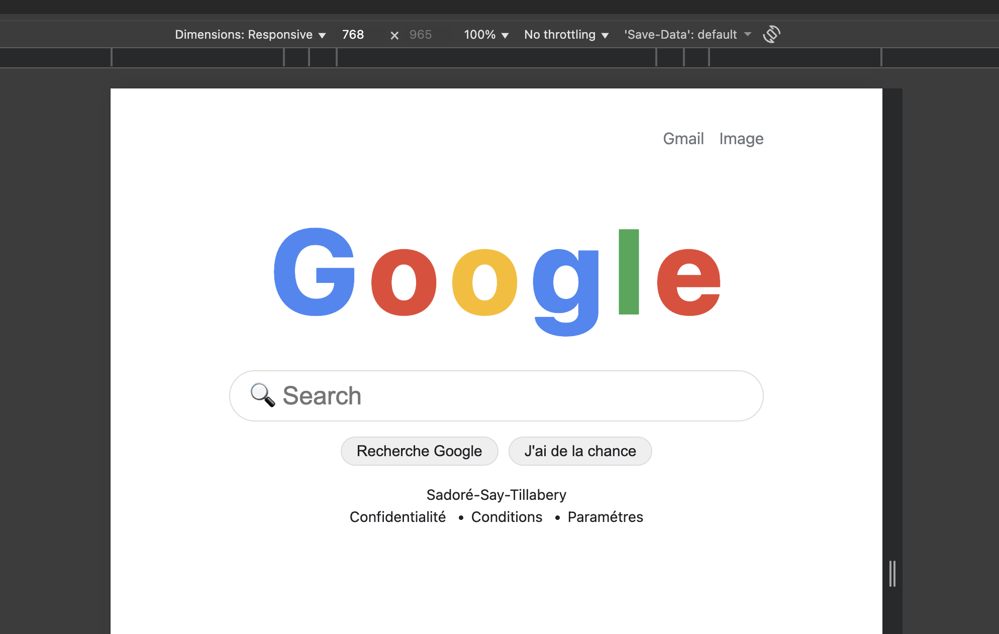
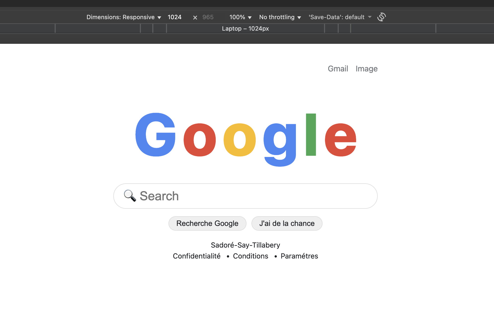
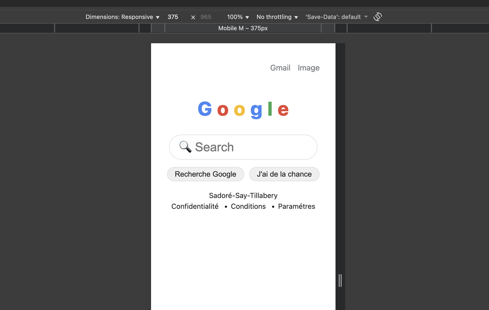

## Projet_3: Google Home Page Clone

Description
Ce projet consiste à recréer la page d’accueil de Google en utilisant uniquement HTML et CSS. L'objectif est de comprendre la structure d'une page web, utiliser les balises sémantiques, appliquer du CSS pour la mise en forme et créer une interface réactive, fidèle à l'originale.

Objectifs
Apprendre à structurer une page web avec HTML et CSS.

Utiliser des balises HTML sémantiques pour une meilleure organisation du contenu.

Créer un design responsive pour s'adapter à différents types d'écrans.

Respecter les bonnes pratiques d'accessibilité et organiser le code proprement avec séparation du contenu et du style.

Technologies utilisées
HTML : Structuration de la page avec des balises sémantiques.

CSS : Mise en forme de la page, gestion de la responsivité avec media queries.

Flexbox : Pour un alignement centré et fluide des éléments.

Emojis : Utilisation d'icônes simples comme le 🔍 pour la barre de recherche.

## Expériences personnelles

Structuration HTML : Utilisation des balises sémantiques comme header, main, et footer pour une meilleure organisation.

Responsive Design : Adaptation de la page pour les écrans mobiles, tablettes et ordinateurs de bureau via media queries.

CSS pour l'UX/UI : Application de couleurs spécifiques de Google et mise en place d’un design minimaliste et propre.

Accessibilité : Respect des bonnes pratiques d'accessibilité pour améliorer l'interaction avec la page.

Liste des balises et explications
header : Contient les éléments d’introduction, comme le logo ou les liens de navigation.

Signification : Définie la zone d'en-tête de la page.

main : Contient le contenu principal de la page.

Signification : Zone principale où les utilisateurs interagiront (par exemple, la barre de recherche).

footer : Contient les informations de bas de page, comme des liens ou des mentions légales.

Signification : Section située en bas de page.

input : Champ de saisie pour la recherche.

Signification : Permet à l’utilisateur de saisir du texte (recherche).

display: flex; : Utilisé pour centrer les éléments horizontalement et verticalement.

Signification : Méthode de mise en page flexible.

@media : Permet de créer des styles conditionnels selon la taille de l’écran.

Signification : Garantit la responsivité du site.

font-family : Définit la police de caractères utilisée.

Signification : Utilise la police de Google et des polices système pour garantir une lisibilité optimale.

background-color et color : Définit les couleurs de fond et de texte.

Signification : Applique les couleurs caractéristiques de Google pour la page.

border-radius : Arrondit les coins des éléments comme les boutons ou le champ de recherche.

Signification : Améliore l’aspect visuel avec des bords plus doux.

## Capture d'ecran:

